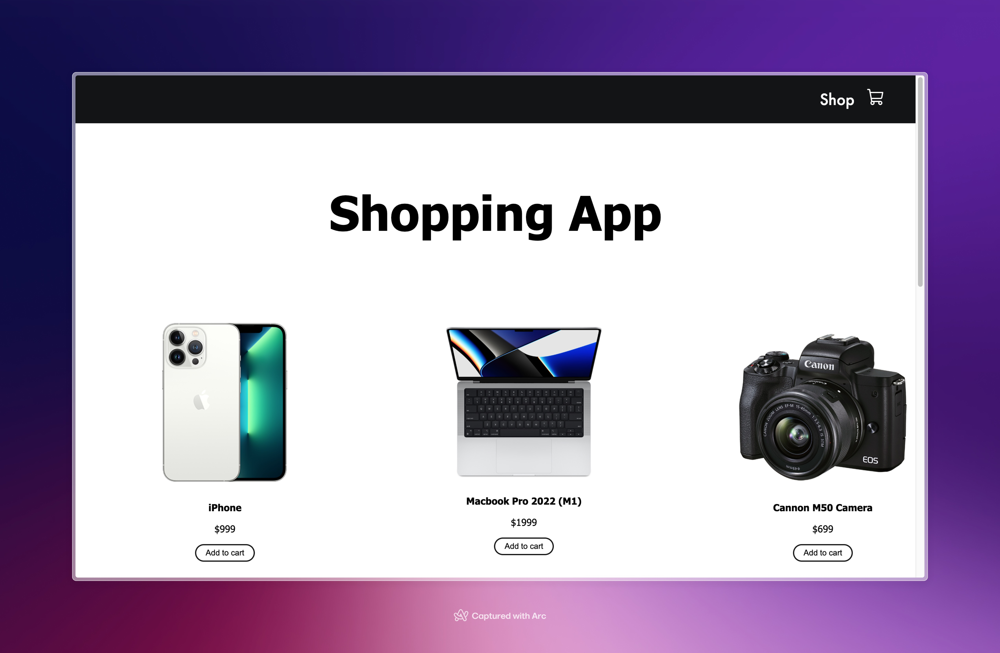
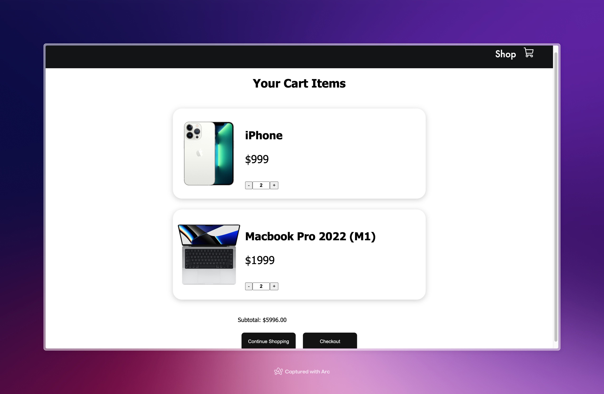

# Shopping Cart App 🛒
A simple React-based shopping cart application showcasing essential e-commerce functionality. This project focuses on frontend-only development and dynamic cart management.

## Features 📋
### Add Items to Cart:
Select products and add them to your cart with one click.

### Edit Quantities:
Directly adjust the quantity of items in the cart.
[Products](./public/edit%20products.mov)
### Dynamic Total:
View the total price update as items are added, removed, or edited.

### Empty Cart Message:
See a friendly message when the cart has no items.

## Technologies Used 🛠️
- React: For building user interfaces.
- React Context API: For managing state across components.
- Phosphor Icons: For modern, sleek icons.